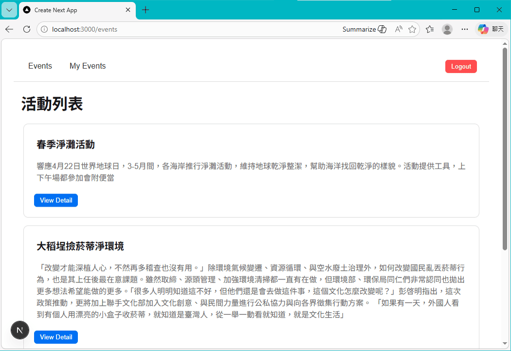
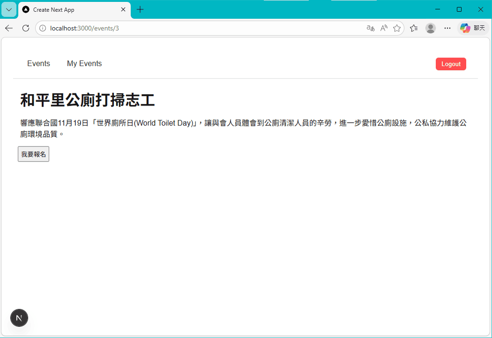

# Event Registration System
A fullstack event registration system built with Next.js App Router and Prisma.

Users can:
- View event list
- View event detail
- Register for an event
- Cancel registration

Authentication is handled with JWT.

## Tech Stack

Frontend
- Next.js (App Router)
- React
- TypeScript

Backend
- Next.js API Routes
- Prisma ORM

Database
- SQLite

Authentication
- JWT

## Features

- Event list page
- Event detail page
- Register for event
- Cancel registration
- JWT authentication

## Screenshots




## Installation

```bash
npm install
npx prisma migrate dev
npm run dev

